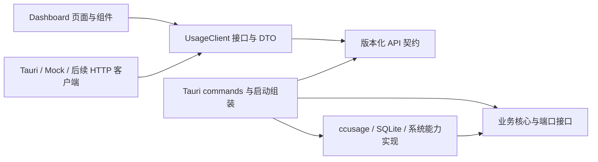
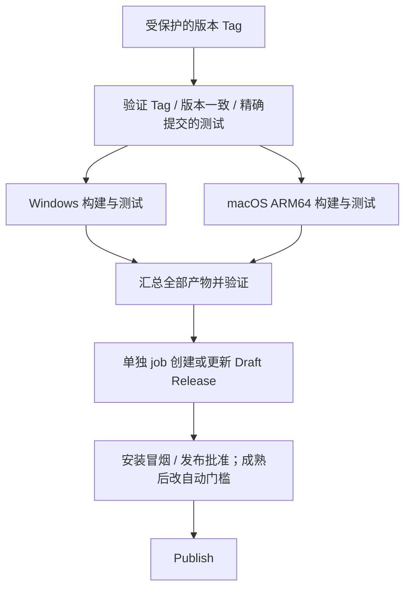

# agent-usage-dashboard 开发与发布计划

> 项目名称：agent-usage-dashboard；项目目录：`agent-usage-dashboard`  
> 文档版本：V0.2.2（当前仅开发 Windows x64 与 macOS Apple Silicon，不代表软件已经发布）  
> 核实日期：2026-10-04  
> 目标：将 ccusage 与 UI Dashboard 打包成 Windows / macOS 桌面软件  
> 当前目标平台：Windows x64、macOS ARM64（Apple Silicon）；Intel Mac 暂不开发  
> 原则：本地优先、前后端分离与解耦、安装包小、默认无遥测、可通过 GitHub Actions 构建  
> 当前状态：项目目录只有本计划，尚未初始化 Git 仓库；没有应用代码、安装包或已运行的 CI。

## 1. 可行性结论与关键决策

**可以实现。推荐继续采用 Tauri 2 + React / TypeScript + Rust + SQLite，并将固定版本的 ccusage 原生程序作为 sidecar 随应用分发。** 用户安装一个软件；前后端在代码和职责上分离，通过 Tauri IPC 通信，开发工具不随应用分发。

“前后端分离与解耦”是强制架构约束：前端、业务核心、基础设施实现和桌面宿主按职责分类，分别构建和测试。前端只依赖应用接口；业务核心只依赖自己定义的接口，不直接依赖 Tauri、ccusage 或 SQLite。首版在同一安装包内组合运行，不部署云端后端，也不启动本地 HTTP 服务。以后增加浏览器 Dashboard 或独立后端入口时，复用业务核心和接口契约。

| 决策 | 选择及理由 |
|---|---|
| 桌面框架 | Tauri 2；复用系统 WebView，适合控制发行体积 |
| 前端 | React + TypeScript + Vite；shadcn/ui 按需使用 |
| 图表 | ECharts 按需导入；以构建分析决定保留的图表类型 |
| 后端 | Rust Core 定义业务与接口；Adapters 实现采集/存储；Tauri 负责入口与组装 |
| 数据库 | rusqlite + bundled SQLite；首版只选一个数据库访问库 |
| 用量引擎 | ccusage sidecar；保留独立 Provider Adapter，避免 UI 绑定 CLI JSON |
| 平台 | Windows x64、macOS ARM64（Apple Silicon）分别出包 |
| 体积 | 每架构安装包暂定预算 40 MiB；以 Phase 0 实测决定能否达标 |
| 仓库与发布 | 拟采用 Public GitHub + MIT + Actions + Releases |
| 网络 | 日常本地统计可离线；更新检查、在线价格刷新以后由用户开启 |

Tauri 使用系统 WebView，支持内嵌外部可执行文件；sidecar 必须匹配目标架构。[Tauri 架构](https://v2.tauri.app/concept/architecture/)、[Sidecar 文档](https://v2.tauri.app/develop/sidecar/)

## 2. 对 V0.1 原计划的评审

原计划的技术方向合理，但应先修正数据与发布契约，再扩展功能。

| 原计划的问题 | 影响 | 本次修订 |
|---|---|---|
| 仅按前端/后端目录分开，核心仍直接依赖数据库和桌面框架 | 更换框架、来源或存储时牵动业务和 UI | 固定单向依赖，接口归核心所有，具体实现通过构造参数注入 |
| 把支持某个 Agent 等同于支持其全部产品 | Codex 被误认为 ChatGPT 网页，Claude Code 被误认为 Claude Web / Cowork | 建立产品级能力矩阵 |
| 将 daily / session JSON 当成逐条 usage event | 重扫重复入库，跨日会话错误归属 | 首版采用报表快照；事件数据另建通道 |
| 将 token 数值放进记录 ID 的哈希 | 数值修正后成为新记录，旧记录残留 | 业务身份和内容校验分开 |
| 只有整条记录的 accuracy | 精确 token 与估算费用混在一起 | 字段级精度、缺失值、覆盖范围分别表达 |
| 直接累加 input / output / cache / reasoning | 缓存和推理可能已包含在 input / output 中 | 每个 Adapter 明确桶的包含关系 |
| 小包目标没有包括 WebView2 安装条件 | 下载包小，但干净系统仍需额外运行时下载 | 区分安装包、依赖下载和安装后体积 |
| 每个平台构建时直接操作 Release | 某个平台失败后可能留下不完整发布 | 两端产物验证后由单独 job 汇总发布 |
| 将所有 CI/CD 成本写成零 | 忽略 artifact / cache、证书和其他服务费用 | 分别说明 runner、存储和签名成本 |
| 要求最后才考虑签名 | sidecar 签名或最低系统版本问题发现太晚 | 尽早做打包验证；正式签名可后置至公开测试前 |
| ChatGPT / DeepSeek 按版本直接承诺 | 数据源或具体 Harness 尚未确认 | 保留路线，但以可采集性验证作为进入开发的条件 |

本次只修订开发计划。公开仓库创建、推送、证书配置及发布安装包属于后续执行事项。

## 3. 支持范围与已核实事实

### 3.1 “Provider、产品、模型、账号”分开

- `providerId`：数据采集适配器，例如 `ccusage.codex`。
- `productId`：用户使用的产品，例如 `codex`、`chatgpt-web`、`claude-code`、`antigravity`。
- `modelId` / `modelVendor`：模型及厂商；Antigravity 可以使用不同厂商模型，不能据此改变产品归属。
- `accountId`：可选的本地账号标识；日志未提供时为空，不读取认证文件来补全。
- `deviceId`：采集设备；与账号额度的作用域不同。

### 3.2 产品能力矩阵

| 产品 | 数据来源与当前证据 | 目标阶段 | 能承诺的范围 / 限制 |
|---|---|---|---|
| Claude Code | ccusage 已列为支持来源 | V0.1 | 本机可读日志中的用量；字段和路径需两端 fixture 验证 |
| OpenAI Codex | ccusage 已列为支持来源 | V0.1 | 本机可读会话用量；不等于账号所有云端活动 |
| Google Antigravity | ccusage 文档明确说明本地 SQLite 来源 | V0.1 | 已支持的数据库结构；每个平台实测后才能标为稳定 |
| ChatGPT Web | 本次未确认面向普通个人账号的完整真实 token 查询接口 | V0.2 实验性 | 用户开启采集后，估算可见文本；不承诺账单或完整推理 token |
| Claude Web | 与 Claude Code 分开 | 后续可选 | 有明确需求及可用来源再做，不自动扩大首版范围 |
| Claude Cowork | 需要单独调查本地来源和 schema | 后续实验性 | 不假设永久兼容 Claude Code parser |
| DeepSeek Harness | 具体仓库、版本和日志格式待确认 | V0.3 候选 | 有稳定 usage 字段后做 Adapter；只提供正文时最多估算 |
| 其他 ccusage 来源 | 按产品逐个做兼容验证 | 后续 | 上游支持不自动等于本软件已测试支持 |

ccusage 当前文档列出了 Claude Code、Codex、Antigravity，并提供来源专属命令；Antigravity 读取本地 SQLite，并与 Gemini CLI 分开。[ccusage 支持列表](https://github.com/ccusage/ccusage)、[Antigravity 来源说明](https://ccusage.com/guide/antigravity/)

OpenAI 的组织 Usage API 面向 API 组织用量，不能据此承诺普通 ChatGPT 网页订阅用量。Codex 的官方 JSON 输出示例包含 `turn.completed.usage`，这也不代表每种历史本地日志都具有相同格式。[OpenAI Usage API](https://developers.openai.com/api/reference/resources/admin/subresources/organization/subresources/usage)、[Codex JSON 输出](https://learn.chatgpt.com/docs/non-interactive-mode)

### 3.3 核实范围

截至核实日期，上游 `apps/ccusage/package.json` 的版本字段为 `20.0.26`，声明的 native optional dependencies 包括本项目需要的 Windows x64 与 macOS ARM64 包。[上游包清单](https://github.com/ccusage/ccusage/blob/main/apps/ccusage/package.json)

这确认了原生包的设计方向，**不等同于已验证每个 npm 发布包都能下载、大小达标或在目标系统运行**。本次未取得两端发布二进制，也未执行它们；`20.0.26` 只是候选基线。Phase 0 必须确认 npm 发行物、校验值、实际命令和输出，再写入版本锁。

## 4. MVP 与后续版本

### 4.1 V0.1：先交付本地 Agent Dashboard

必须交付：

- Windows x64 与 macOS ARM64（Apple Silicon）的安装包。
- Claude Code、Codex、Antigravity 的检测、来源路径配置、手动刷新和错误诊断。
- Today / Daily / Weekly / Monthly、来源和模型统计、Sessions 列表。
- input / output / cache / reasoning 中实际可获得的字段；缺失显示“不可用”。
- 明确标注的 API 等价估算成本、价格缺失状态。
- SQLite、设备 UUID、最后成功扫描时间、统计覆盖范围。
- JSON 归档导出和 CSV 报表导出。
- 基础设置：时区、Provider 开关、主题、数据目录。
- GitHub 两端构建、fixture 验证、体积报告和 Draft Release 流程。

V0.1 的范围限制必须在 UI 可见：数据主要来自本机；部分日期与会话组合筛选可能不受报表粒度支持。只有三个 Provider 都满足对应平台验收后，才宣传三者正式支持；有缺口时标明实验性或延期，不返回伪造的零值。

### 4.2 版本路线

当前阶段不开发 Intel Mac 版本，也不安排其构建、测试、签名或发布资产。用户目前没有 Intel Mac 测试设备；以后仅在明确恢复该平台需求并具备验证条件时重新评估。Intel Mac 不作为任何当前阶段的完成条件。

| 阶段 | 交付内容 | 进入条件 |
|---|---|---|
| Phase 0 | 两端最小打包、sidecar 契约和体积验证 | 开发第一步 |
| V0.1 | 三个本地来源 + Dashboard + SQLite + 导出 + 构建发布 | Phase 0 通过 |
| V0.2 | 多设备归档导入；ChatGPT Web 估算采集实验 | 导入去重与浏览器采集方案分别通过验证 |
| V0.3 | DeepSeek Harness Adapter；可用来源的 quota；托盘与通知 | 明确 Harness；quota 有可信来源 |
| 后续 | Cowork、更多来源、自动更新、可选同步 | 每项独立验收 |

公开面向普通用户的 Beta 应安排 macOS 正式签名与公证，不必为了版本号等到 V1.0。托盘、开机启动、云同步不阻塞首个统计闭环。

## 5. 前后端分类、接口与解耦边界

### 5.1 分层与依赖方向

采用同仓库、模块化架构。模块可独立验证，发行时统一打包；首版不引入微服务、动态插件系统或额外常驻服务。以下箭头表示代码依赖关系，不是运行时的数据流：



运行时链路为：页面 → 注入的 UsageClient 实现 → IPC → command → 业务用例 → 注入的采集/存储接口实现。**依赖关系不反转为 Core 导入 Adapters**；在启动入口创建具体实现，再通过构造参数传给业务服务。

| 分类 | 负责 | 不负责 |
|---|---|---|
| 前端表现层 | 页面、图表、交互、格式化、loading / error 状态 | 日志解析、去重、计费规则、数据库访问 |
| 前端接口层 | UsageClient、请求/响应 DTO、传输适配 | Provider 原始 JSON、SQL schema |
| 后端业务核心 | 领域模型、统计口径、快照规则、用例协调、采集与存储接口 | Tauri API、SQL、文件/网络/子进程的具体执行 |
| 后端基础设施 | ccusage parser、进程执行、SQLite、文件读写 | 页面状态、图表结构、业务口径的重复实现 |
| 桌面宿主 | IPC、窗口、平台权限、路径选择、生命周期、依赖组装 | 在 commands 里重新写统计与去重算法 |
| API 契约 | 请求/响应、稳定错误码、事件格式、版本协商 | 直接暴露数据库行或供应商内部字段 |

### 5.2 前端独立运行

页面与业务 hooks 只依赖 `UsageClient`，由应用入口注入 `MockUsageClient` 或 `TauriUsageClient`；未来需要时增加 `HttpUsageClient`。页面不出现 `invoke()`、Tauri 事件名或来源命令字符串。

```typescript
interface UsageClient {
  listProviders(): Promise<ProviderSummary[]>;
  startScan(providerId: string): Promise<{ jobId: string }>;
  getScan(jobId: string): Promise<ScanSummary>;
  cancelScan(jobId: string): Promise<void>;
  getOverview(query: OverviewQuery): Promise<OverviewResult>;
  listSessions(query: SessionQuery): Promise<SessionPage>;
  exportUsage(request: ExportRequest): Promise<ExportResult>;
}
```

此处为接口草案，DTO 在 bootstrap 时定义。Tauri SDK 只能在前端 `api/transports/tauri/` 中导入，入口仅负责选择实现。Mock 模式必须能在普通浏览器独立启动、测试和构建，无需 Rust、ccusage、SQLite 或桌面 bridge；不能仅在测试时把不可用的 Tauri API 全部静默忽略。

长扫描返回 job ID；进度事件和轮询都封装在客户端实现内，组件使用一致的状态模型。TanStack Query 管理查询和缓存失效。token 归一化、权威数据选择和费用计算留在后端；前端只做展示格式化，不保留第二套统计算法。

### 5.3 Rust 业务核心与基础设施分开

- `usage-core`：领域模型、业务用例、聚合/去重规则、接口定义；不依赖 Tauri、rusqlite、ccusage 原始 schema 或真实 I/O 实现。
- `usage-adapters`：依赖 Core，实现数据源适配、SQLite repository、文件访问与受控子进程；不依赖 UI，也不反向把自身类型暴露给 Core。
- `usage-contracts`：拥有序列化 API DTO、错误码与契约版本，不依赖 Tauri 或数据库；TypeScript 契约从这里生成。
- `apps/desktop/src-tauri`：依赖上述模块，负责启动组装、Core 模型与 API DTO 的映射、IPC、权限和生命周期。commands 保持薄层。

Core 通过构造参数接收端口实现，不使用全局数据库连接、全局 Tauri AppHandle 或全局 Provider 单例。Provider 注册在启动时完成；新增 Provider 不应修改页面组件或核心统计算法。

| 接口 / 实现边界 | 归属与职责 |
|---|---|
| `UsageSource` | Core 定义检测、能力、采集与取消语义，返回规范化 batch；各来源 Adapter 实现 |
| `UsageRepository` | Core 定义业务查询与原子快照提交要求；SQLite 实现负责 SQL、事务、索引与单写入协调 |
| `Clock` | Core 定义业务所需的时钟接口；测试可注入固定时间，生产使用系统时间 |
| `ProcessRunner` | 仅在采集基础设施内部抽象 executable 执行；Core 不需要知道进程、参数或 stdout |

ccusage 原始 JSON 的解码与字段映射在对应 Adapter；Core 只接收规范化模型并校验公共业务约束。SQLite schema、migration 和连接生命周期归存储实现所有；Core 不导入 SQL 行类型，也不提供“执行任意 SQL”接口。

### 5.4 契约稳定与传输替换

- 明确区分领域模型、数据库模型和 API DTO，不用同一个结构体贯穿所有层。
- TypeScript DTO 从 Rust 契约生成；生成结果作为前端构建输入，CI 检查漂移，日常前端开发不需要重新编译 Rust。
- 契约定义 `apiVersion`、能力列表、分页、日期范围、缺失值、精度、稳定错误码和扫描状态；日志文本不作为前端判断条件。
- 向后兼容地增加可选字段；破坏性修改升级契约版本。客户端遇到不兼容版本明确提示，不靠字段猜测继续运行。
- IPC 与未来 HTTP 采用同一套业务 DTO 和错误语义，文件导出使用业务请求及不透明结果引用；文件保存对话框等平台细节留在宿主适配层。
- 前后端独立构建与测试，初期随同一个软件版本发布。独立部署和网络访问以后另行实现访问控制，不因解耦要求而提前增加服务。

### 5.5 解耦的验收方式

| 替换或变更 | 允许修改的范围 | 必须保持稳定 |
|---|---|---|
| 换图表库或重做 Dashboard | 前端表现层 | 后端统计规则、采集与数据库 |
| ccusage 输出格式升级 | 相关 Adapter、版本锁与 fixture | UI、UsageClient、Core 规范化模型的语义 |
| SQLite 存储实现变化 | repository 实现与 migration | 业务用例和对外 API |
| 为同一产品换采集引擎 | 实现同一来源端口并重新验证能力 | 页面和查询接口 |
| 增加 HTTP / CLI 后端入口 | 新入口、传输映射、组装及必要鉴权 | Core 业务规则；现有桌面入口继续可用 |
| 增加新 Provider | Adapter、注册及能力声明 | 通用 Dashboard；独有功能通过可选能力扩展 |

CI 必须约束依赖方向：前端用 lint 限制跨层导入；Rust 检查 Cargo 依赖图，禁止 Core 依赖 adapters / Tauri / rusqlite，禁止出现循环依赖。Core 单元测试使用内存实现；SQLite、CLI 和 IPC 的集成测试分别放在对应边界，不让 Core 单元测试依赖这些设施。

这些接口和 crate 属于代码组织，不要求增加运行时进程。发行物仍是一套桌面安装包，用户无需安装 Node.js、Bun、Rust 或数据库服务。

## 6. ccusage 集成与版本锁定

### 6.1 发行物策略

优先使用上游已发布的 native binary；不在用户启动时执行 `npx`、安装 npm 包或下载任意最新版。CI 的 Node / pnpm 仅用于构建前端和准备资源。

拟增加 `ccusage.lock.json`，逐目标记录：

- 精确 ccusage 版本、包名与发行物 URL。
- npm tarball 的 `dist.integrity`，以及提取后二进制的 SHA-256。
- 二进制相对路径、目标架构、已验证的最低系统版本。
- 已验证的命令及 fixture schema 基线、许可证来源。

校验值必须经升级流程确定并提交；不能每次 CI 临时下载一个包，再把现场计算的哈希当作预期值。校验和证明内容一致，不单独证明发布者身份。

| Rust target | 对应 native 包 | Tauri 资源文件 |
|---|---|---|
| `x86_64-pc-windows-msvc` | `@ccusage/ccusage-win32-x64` | `ccusage-x86_64-pc-windows-msvc.exe` |
| `aarch64-apple-darwin` | `@ccusage/ccusage-darwin-arm64` | `ccusage-aarch64-apple-darwin` |

Tauri 配置片段：

```json
{
  "bundle": {
    "externalBin": ["binaries/ccusage"]
  }
}
```

`prepare-ccusage.mjs --target <triple>` 的职责：白名单映射目标 → 读取锁 → 获取包 → 校验 → 安全提取 → 检查架构 → 重命名 → macOS 设置执行位。压缩包路径不得越过暂存目录。二进制不提交 Git；每次只放入本目标所需文件。[Tauri Sidecar 命名要求](https://v2.tauri.app/develop/sidecar/)

### 6.2 命令与配置控制

候选命令如下；参数及 JSON 形状必须用最终固定版本运行验证，不把在线 main 文档视为该版本保证：

```text
ccusage claude daily --json --offline --breakdown --timezone <IANA_ZONE>
ccusage codex daily --json --offline --breakdown --timezone <IANA_ZONE>
ccusage antigravity daily --json --offline --breakdown --timezone <IANA_ZONE>
ccusage <source> session --json --offline
```

- 只调用用户启用的来源；不默认扫描所有 ccusage 支持的来源。
- Rust 固定 executable 和参数结构，日期、枚举、路径经过校验，不拼接 shell 字符串。
- 使用受控工作目录和环境变量，明确覆盖来源路径、时区、离线和成本模式。
- 核实上游配置文件搜索规则；不能让用户项目中的配置静默覆盖应用统计口径。无法隔离的配置项必须显示并纳入 scan scope。
- 默认使用离线价格；Phase 0 验证首次启动在无价格缓存、无网络时也能工作。
- 为每个子进程设置超时、输出大小限制和取消机制；同一 Provider 禁止重入。Windows 隐藏控制台窗口，退出时回收进程。
- 不把原始 stdout / stderr 直接放入诊断日志，只保留允许的结构化错误。

### 6.3 升级流程

固定新版本和两端哈希 → CLI / schema fixture → 两端运行 → 体积比较 → 打包内 sidecar 冒烟 → 合并。依赖机器人可以提出升级 PR，但不自动发布。

缺少某个平台原生包时，优先调查固定源码构建是否可重复；不要静默改为要求用户安装 Node。直接链接上游库或移植 parser 只作为后续优化候选，需评估体积收益与维护成本。

## 7. 核心数据决策：聚合快照与事件分开

### 7.1 首版存储报表快照

ccusage 文档主要提供 daily / weekly / monthly / session 聚合报表。JSON 可用于集成，但不能仅因为它是 JSON，就假设包含每条请求的事件 ID、时间和 session 关系。[ccusage JSON 输出](https://ccusage.com/guide/json-output)

因此 V0.1 采用 `report_snapshots + report_rows`：

- Daily 用于日趋势、Today 和按天范围统计；Week / Month 可从同口径 Daily 汇总。
- Session 用于会话列表；会话的累计总量不能按最后活跃时间全部归入某一天。
- Daily、Weekly、Monthly、Session 是相同用量的不同视图，不能互相相加。
- 总计行与模型明细行是父子关系，不能相加；明细缺失时保留总量和覆盖说明。
- 不从独立的“每日总量”和“会话总量”推导不存在的“每日 × 会话”明细。
- 如果固定版本能可靠输出事件数据，再单独接入事件存储；UI 不依赖这一假设。

### 7.2 快照身份与替换规则

一个逻辑快照的 key 包含：

```text
productId + sourceDatasetId + reportKind + timezone
+ queryScope（范围、过滤条件、周起始日等会改变口径的参数）
```

快照内行 key 使用日期 / session / model 等稳定维度。token 值、费用、采集时间、parser 版本不放入业务身份；它们属于内容或版本信息。所有 key 用规范化结构编码，避免字符串拼接歧义。

一次完整成功采集先写 staging，在事务中替换相同 scope 的当前快照，并删除该 scope 内已被新结果替代的旧行。重复刷新不得执行 `old += new`。parser 或价格版本变化时更新快照元数据，而非追加可求和的副本。

不同请求的 scope 可能重叠，例如“全历史”和“最近 7 天”。查询层必须为同一数据集、产品、时区和口径选择互不重叠的权威分区，不能把这些快照直接 UNION 后求和。首版优先维护一套标准 Daily 分区和一套 Session 视图；UI 的日期与模型过滤在本地查询完成，临时过滤报表只作为独立缓存，不进入全局总计。

若跨多个 CLI 命令采集，记录开始/结束时间；活跃会话可能使两份报表略有差异，不能宣称数据库级一致快照。需要同源一致读取时，先验证上游单次加载多报表的模式及来源隔离能力，再启用。

失败、超时、解析异常、数据库锁定时保留上次成功数据并标记 stale。只有确认来源可读且完整覆盖该 scope 的成功空结果才可表示零；文件消失、日志轮转或历史清理不能自动清空已留存历史。未完整覆盖的历史分区保留并标记 archived / incomplete，直到显式重建。

### 7.3 日后事件通道

原始事件使用来源稳定的 event ID，并保留源数据集、产品、会话身份。只有没有稳定 ID 时才考虑经过测试的来源位置 / 内容指纹方案；不能仅凭 token 相同判断是重复事件。

累计计数需要先确定 reset / rollover / retry 语义再转换为增量；计数变小不直接变成负用量。事件与快照即使同时存在，对一个查询范围也只选一个权威来源，不能叠加。

## 8. Token、费用与数据精度

### 8.1 精度是字段属性

保留 `exact / derived / estimated / unavailable`，并定义：`exact` 仅表示来源直接报告，不能暗示完整覆盖所有活动或等于账单结算。

```typescript
type Accuracy = "exact" | "derived" | "estimated" | "unavailable";

type Metric<T> =
  | { value: T; accuracy: Exclude<Accuracy, "unavailable"> }
  | { value: null; accuracy: "unavailable" };

interface TokenMetrics {
  inputUncached: Metric<number>;
  cacheRead: Metric<number>;
  cacheWrite: Metric<number>;
  outputTotal: Metric<number>;       // 统一为包含 reasoning 的输出
  outputReasoning: Metric<number>;   // outputTotal 的子集，不再次求和
  total: Metric<number>;
}

interface CostEstimate {
  amountUsd: Metric<string>;         // 十进制定点字符串，避免二进制浮点记账
  kind: "api-equivalent-estimate";
  pricingVersion: string | null;
  pricingAsOf: string | null;
  missingModels: string[];
}
```

每份报表还应携带 `source`、`collectorVersion`、`normalizationVersion`、`collectedAt`、`coverage`、`warnings`。覆盖范围和精度分开：部分日志里的精确计数仍是部分覆盖。

未知值使用 `null`，真实零使用 `0`。汇总含缺失字段时返回“已知部分 + 覆盖说明”，不能把 `null` 当零。混合精确与估算数据的总计标为 mixed / estimated，并保留分别查看的入口。

### 8.2 统一桶语义

采用互斥输入桶：未缓存输入、缓存读取、缓存写入；输出总量包含推理输出。仅在数据源能够完整映射时：

```text
Total = InputUncached + CacheRead + CacheWrite + OutputTotal
```

Adapter 必须分别核实原始日志和 ccusage JSON 的语义，防止上游已经归一化后再次减去 cache。若上游输出的是 visible output，则在该 Adapter 中与 reasoning 合并为 outputTotal；若本来包含 reasoning，就不再相加。

简单验收例：来源 input=1000（其中 cached=600），output=200（其中 reasoning=50），则总量是 1200，而不是 1850。该例说明包含关系，不代表所有 ccusage 输出都采用这个原始格式。

数据不全时优先保留可信的来源 total，并标明 breakdown 不完整；不要为凑齐等式创造数值。Rust / SQLite 使用 64 位整数；IPC 超出 JavaScript 安全整数范围时使用十进制字符串或明确拒绝，不能静默丢失精度。

### 8.3 费用不等于订阅账单

界面固定使用“API 等价估算成本”。ChatGPT / Claude 订阅费、真实 API 结算和该估算分开，不推导“你已经花了多少钱”。

首版优先归一化 ccusage 的成本结果，避免同时维护两套价格引擎；固定成本模式并记录价格来源。未知模型的零成本占位要映射为 unavailable / 部分已估价，不能显示成免费。上游 JSON 文档提供 `unpricedModels` / `missingPricing` 标记，但仍需核验固定版本是否具备。[ccusage 价格缺失字段](https://ccusage.com/guide/json-output#unpriced-models)

若没有完整价格版本信息，显示“ccusage 固定版本内置价格，日期未知”；价格更新是否重估历史必须是明确操作，不能悄悄改变历史口径。首版货币仅 USD；多币种与汇率以后再加。

## 9. SQLite 与查询约束

建议首版表结构：

| 表 | 内容与约束 |
|---|---|
| `devices` | 随机 UUID、用户可改显示名、系统与架构；不使用硬件序列号 |
| `source_datasets` | 产品、数据集 UUID、origin device、路径配置与采集作用域 |
| `scan_runs` | job、采集器版本、开始/结束时间、成功/失败、覆盖范围和诊断码 |
| `report_snapshots` | 逻辑快照 key、revision、scope、timezone、当前成功版本、价格与归一化版本 |
| `report_rows` | 快照版本 + 行 key 唯一；日期或 session 维度、模型、各字段与精度 |
| `app_settings` | 配置版本、时区、Provider 开关 |
| `schema_migrations` | 单调递增的数据库 schema 版本 |

`quota_snapshots`、`usage_events`、`import_batches` 在对应功能实施时增加，首版不预先实现同步框架。Sessions 可先从 session 快照查询；未来有实体关系需求时再拆表。

数据库要求：

- 位于操作系统应用数据目录，不位于安装目录；卸载默认保留，应用内提供明确的清除入口。
- 启用外键、WAL 和合理 busy timeout；索引覆盖快照查询、产品/日期、session 查找。
- 保留稳定 `sourceDatasetId`；路径更名不自动变成新来源，同一目录重复配置要识别。
- scope 中的可选维度必须规范化，不能依赖 SQLite `NULL` 的 UNIQUE 行为做去重。
- 备份使用 SQLite backup API 或关闭写入后的可靠备份流程，不直接复制正在写入的主 DB 文件而漏掉 WAL。
- migration 前备份并使用事务；旧版本遇到较新 schema 时拒绝写入并说明原因。
- 不保存完整 CLI 原始 JSON，因为其中可能含路径、标题或正文；只白名单提取需要的 metadata。

日期规则：事件时间保存 UTC；报表同时保存 IANA 时区和当地日期。范围统一使用 `[start, end)`。改变时区后需从原始日志重新分桶，单个每日总量无法精确重分配；原始日志已清理时保留原时区标记，不伪造转换。夏令时和跨年周必须有 fixture。

## 10. Provider 能力、刷新与错误处理

每个 Adapter 声明以下能力，UI 依据能力展示，而非假设所有来源字段齐全：

```text
reportKinds: daily / session / events
supportedDimensions: day / model / session / project
supportedMetrics: input / output / cache / reasoning / cost
supportsDateSessionIntersection: true / false
supportsIncrementalCollection: true / false
supportsQuota: true / false
```

主要操作为 `detect`、`capabilities`、`collect(request)`，返回带覆盖范围的 batch。quota 通过独立接口获取，不混入 token parser。

扫描策略：

1. 首次启用来源时说明将读取的位置；允许选择自定义目录，不扫描整个磁盘。
2. 先显示已有 SQLite 数据，再异步刷新。
3. 手动扫描已实现。自动完整扫描阶段提供 1、5、15 分钟检查间隔（默认 5 分钟），默认关闭；调度放在原生宿主，来源无变化则跳过采集。
4. CLI 如果每次都全量扫描，就明确记录这一成本；文件监听不等于增量解析。历史越大时应退避并允许取消。
5. 大历史按能证明完整覆盖的范围重建；常规刷新只替换对应成功分区。不要仅凭最后扫描时间跳过晚到或被修正的数据。
6. 休眠恢复、多个窗口或重复点击合并为单个任务；退出时终止任务并回收 sidecar。

状态至少区分：`Not detected`、`No data`、`Ready`、`Scanning`、`Permission denied`、`Schema unsupported`、`Partial`、`Stale`、`Error`。诊断仅包括版本、错误码、耗时、脱敏路径和建议；解析失败不能显示“今日 0 tokens”。

### 10.1 自动完整扫描第一版（0.0.6 之后）

本阶段将定时检查、有效日志变化和休眠恢复纳入 Rust 宿主统一调度器；只有已启用来源发生变化或缺少可信成功基线时，调用现有完整扫描。新增自动采集设置、请求合并/限流、取消/失败退避、退出回收和前端后台事件刷新。保持完整快照语义与 `supportsIncrementalCollection=false`，真正增量另按来源实施。

详细实施顺序、兼容要求、验收清单和新会话可复制 prompt 见 [自动完整扫描开发计划](docs/coordination/AUTO_FULL_SCAN_PLAN.md)。

## 11. ChatGPT Web、Cowork 与 DeepSeek 的接入方案

### 11.1 ChatGPT Web：先做可用性验证，再做扩展

首个实验可以从用户主动导入的数据或显式开启的当前页面采集开始；必须核实实际格式和可见范围，不假设导出文件包含真实 token。

若做 Chrome / Edge 扩展，建议流程：

```text
用户开启采集
→ 扩展在本地对可见文本做 token 估算
→ 仅生成计数、会话标识、时间、模型标签和估算器版本
→ Native Messaging Host
→ 应用导入队列
→ Rust Core / SQLite
```

将 tokenizer 尽量放在扩展内，避免向桌面程序传输聊天正文。模型 tokenizer 未知时明确使用估算器，并记录算法及版本。浏览器页面提供的模型标签也可能不完整。

必须处理以下边界：

- 可见文本估算不包含完整系统指令、历史上下文重传、隐藏推理、工具调用和图片/音频计费。
- 页面重新打开、滚动加载、回复流式更新、编辑、重新生成和分支切换不得重复累计同一内容。
- 采集范围不完整时显示“仅已观察内容”；无法获得历史消息原始时间时，不将今天导入的旧对话计为今日使用。
- 默认与 Agent 实际 usage 分开展示；如果用户选择混合视图，明确标注口径不同。
- 不导出 Cookie、不读取 session token、不调用未经核实的私有接口、不上传正文。
- 扩展是额外安装组件，桌面安装包不能被描述为已自动安装并授权浏览器扩展。

Native Messaging 需要独立 host、浏览器注册配置和扩展 ID allowlist，Tauri IPC 不能直接充当浏览器扩展的连接方式。Windows 安装/卸载处理用户级注册；macOS 处理浏览器指定的 manifest 位置。Edge 的配置也需独立核验。host 使用带长度的 stdio 协议、限制消息大小和 schema，stdout 不混入日志。[Chrome Native Messaging](https://developer.chrome.com/docs/extensions/develop/concepts/native-messaging)

建议 host 将校验后的 metadata 写入用户私有的有限大小队列，由唯一 Core 写入 SQLite；应用未运行时保留待导入消息，重启后幂等消费。首版无需为此开放 localhost 端口。浏览器扩展与 host 各自有版本兼容范围和独立验收。

### 11.2 Claude Cowork

先确认具体版本、平台、可读数据源以及是否与 Claude Code 数据重叠，再决定复用哪一层。可以共用正常化工具，但不能在没有 fixture 的情况下共用 parser 或重复纳入两种产品总计。

### 11.3 DeepSeek Harness

“DeepSeek”是模型/服务名称，“Harness”决定本地执行和日志格式。开发前需要一个明确的仓库或产品名称、版本及最小脱敏样例；不预设存在名为 DeepSeek Harness 的统一标准格式。

若是自建 Harness，优先设计版本化 JSONL usage 事件，至少包含稳定 event ID、session ID、UTC 时间、模型、token 字段及其包含关系。若使用现成 Harness，则先调查其原生日志；OpenAI 兼容 API 并不自动意味着存在可回溯的本地用量记录。

Adapter 只读来源、独立建 fixture。缺少真实 usage 时标为 unavailable / estimated，不用模型名称推算“精确 token”。这项能力不会阻塞 V0.1。

## 12. Quota 与多设备

### 12.1 额度独立建模

Token、估算费用、订阅额度分别展示。quota 接口可用时才实现：

```text
providerId / productId / accountId?
windowId / scope（account、workspace、model 等）
unit（percent、tokens、requests、credits、unknown）
used? / limit? / remaining?
windowStart? / resetAt? / capturedAt / expiresAt?
source / accuracy
```

没有数值上限的百分比不能反推 token 配额。窗口长度和重置时间按来源提供，不能把所有产品硬编码成 5 小时 / 周额度。`resetAt` 缺失则不显示倒计时；过期快照显示 stale。相同账号在两台设备看到的同一额度只保留一个窗口状态，不能相加。

### 12.2 多设备归档

V0.1 的 JSON 导出从第一版包含 `archiveSchemaVersion`、`appVersion`、`sourceDatasetId`、`originDeviceId`、产品、时区、报表粒度、scope、revision、精度与覆盖信息。`.aiusage.json` 是可合并归档；CSV 仅用于报表阅读，不作为可靠回导格式。

V0.2 导入要求：

- 保留原设备和数据集身份，不将导入的数据重新归属为当前电脑采集。
- 同一归档重复导入不增加总量；同一快照的新 revision 替换旧版，旧归档不能覆盖新版。
- revision 在原数据集内单调递增；检测导入冲突，不仅凭不同设备的采集时钟判断新旧。
- 日期相同但来源、时区或 scope 不同的数据不能直接当作同一个分桶合并。
- 复制原始日志到另一台机器后，仅凭 device ID 无法全局去重。已知数据集副本沿用 dataset 身份；身份未知且可能重叠时提示选择来源，默认不承诺自动去重。
- 聚合快照缺少事件身份时，不能保证两个重叠数据集精确合并。UI 必须显示这一限制；真正全局去重依赖稳定事件标识。
- 导入前显示来源、时间范围和预计变更；schema 校验、文件大小限制、事务写入与冲突报告必须具备。
- 导出默认去除绝对路径、项目名及账号可识别信息；用户可主动选择附加项目标签。

LAN / Cloud Sync 不在首版实施；将来默认关闭，仅同步规范化 metadata，与本地功能解耦。

## 13. Dashboard 与用户可见行为

| 页面 | 首版内容 | 必须避免的误导 |
|---|---|---|
| Overview | 今日/所选日期的已知 token、来源分布、模型分布、API 等价估算成本 | 不把未知显示成零；不把 Web 文本估算混成服务端用量 |
| Providers | 检测结果、能力、路径、版本、最后成功时间、覆盖范围、刷新与诊断 | “已检测”不等于“所有数据都可读” |
| Sessions | 会话、产品、模型、可用 token 字段、设备、最后活动时间 | 只知道 lastActivity 时不显示伪造的开始时间 |
| Settings | 时区、主题、来源开关、导出、数据库维护、隐私说明 | 关闭窗口行为必须明确，开机启动默认关闭 |
| Devices（V0.2） | 原设备分组、归档导入、数据集冲突 | 不把同一数据副本当成新增用量 |
| Quotas（后续） | 可确认的窗口与剩余量、重置时间、更新时间 | 无来源时显示 unavailable，不从 token 用量猜测 |

Sessions 的日期过滤若只能做到“该期间活跃的会话”，就用这个名称，并注明展示的是全会话累计量。只有拿到 session × date 数据才展示“该会话在所选期间的用量”。不支持的交叉筛选应禁用并说明，而非返回貌似精确的数值。

所有页面处理 loading、empty、no-permission、partial、stale 和 scan-error。扫描失败时仍可浏览上次成功结果。示例截图使用合成数据，不能把示例 quota 百分比或用量写成真实值。

## 14. 隐私与本地安全边界

应用默认不上传聊天内容、项目文件或 usage metadata，不读账号密码 / Cookie，不开启遥测。要承认 parser 可能需要读取含正文的日志文件，承诺应是“仅提取 usage，正文不持久化、不外传”，而不是无法兑现的“永远不会读取正文所在文件”。

工程约束：

- 前端仅可调用有限的业务 commands；不授予任意 shell、任意文件读写、任意 URL 打开能力。
- Rust 再次校验 Provider ID、目录、日期和导出目标；Tauri capability 不等于对 Rust 或 sidecar 的操作系统沙箱。
- sidecar 是与应用同用户权限的受信任程序，其读取范围和网络行为需要针对固定版本审计与测试。
- 生产 UI 只加载打包资源，设置 CSP；日志和模型名当作纯文本，不当作 HTML 执行。
- 数据库只保存白名单字段；日志和诊断不得包含认证文件、API key、聊天正文或完整原始输出。
- 通常无需凭据；将来官方 API 适配器确实需要时，使用系统凭据存储，避免进入 SQLite / 前端。
- 价格与软件更新如需联网，要有独立开关与目的说明；默认采集使用离线模式并验证无外连。
- JSON 导入严格校验；CSV 对可能被表格软件当作公式执行的文本单元格做安全转义。
- crash / debug 数据和 fixture 同样需要脱敏；不自动上传故障包。

## 15. 安装包体积与平台兼容性

### 15.1 先定义“尽量小”

以下是**工程预算，尚未实测，不是交付承诺**。统一使用 MiB（1 MiB = 1,048,576 bytes）。

| 项目 | 暂定目标 | 统计方式 |
|---|---|---|
| 每架构常规安装包 | 争取 20 MiB 左右；预算 40 MiB | 最终 `.exe` / `.dmg` 文件实际大小 |
| 前端静态资源 | 原始合计不超过 5 MiB | `dist` 分项记录 JS / CSS / 字体 / 图片 |
| 安装后应用体积 | 单独实测，不混入下载包大小 | 主程序 + sidecar + 静态资源 |
| 系统 WebView2 | 单独列出依赖下载与安装占用 | 无运行时的干净 Windows 测试 |
| 用户数据 | 单独统计、可维护 | SQLite、备份、应用缓存 |

Phase 0 必须记录空 Tauri 壳、ccusage 原生文件、整合后安装包三个基线，再决定预算。CI 超过 40 MiB 或相对上次同平台版本增长超过 10% 时要求解释；不得通过遗漏 sidecar 或必要依赖来满足数字。

### 15.2 Windows

使用 NSIS `.exe` 作为首选；确有企业部署需要时再增加 MSI，避免首版维护两种安装器。使用系统 WebView2，缺失时由 bootstrapper 安装：

```json
{
  "bundle": {
    "windows": {
      "webviewInstallMode": {
        "type": "downloadBootstrapper"
      }
    }
  }
}
```

该方案安装包小，但缺少 WebView2 的机器首次安装需要联网，额外下载不包含在本应用安装包大小内。已有运行时的电脑和应用日常本地统计可以离线。若要求完全离线安装，应另做包含运行时的较大离线包，并单列体积预算。[Tauri WebView2 安装选项](https://v2.tauri.app/distribute/windows-installer/#webview2-installation-options)

目标为 Windows 10/11 x64；具体最低版本、WebView2 版本、ccusage 与 MSVC 运行库依赖在 Phase 0 锁定。新版 GitHub runner 构建成功不能代替旧系统安装测试。Windows ARM64 以后独立验证，不把 x64 模拟运行当作原生支持。

### 15.3 macOS

仅发布 Apple Silicon 的 ARM64 DMG，不生成 Intel Mac 或 Universal Binary 安装包。利用系统 WKWebView；只嵌入 ARM64 sidecar，构建与安装验收均针对 Apple Silicon。

最低 macOS 版本取 Tauri / Rust 产物、前端 WebView 能力与 ccusage 的实际兼容交集，设置一致的 deployment target 并在最低版本验证。构建 runner 的系统版本不是自动得到的最低支持版本。

### 15.4 体积优化顺序

1. 只打包当前架构的主程序与一个 ccusage，不重复嵌入 Node / Bun / Chromium。
2. 前端按需导入 ECharts、精简字体与图标，不分发开发依赖和 source map。
3. Rust release 比较 `opt-level = "s"` / `"z"`、LTO、`codegen-units = 1` 和 strip 的真实收益；根据性能和诊断需要选择。
4. sidecar 与主程序的裁剪在签名前完成；保留需要的调试符号于独立开发 artifact。
5. 检查二进制动态依赖，在没有开发工具的机器上测试；不要只检查 `.exe` 能生成。

默认不引入 UPX、自制压缩启动器或首次启动远程下载执行文件。只有实测说明 ccusage 成为主要瓶颈后，才评估上游库复用或特定来源的自有 Rust parser。

性能也要记录：固定测试机和脱敏数据集，测首屏缓存查询耗时、全量/重复扫描时间、整应用进程树的空闲内存与 CPU。初始目标是缓存首屏约 1 秒内可交互，扫描不冻结 UI；Phase 0 建立硬件与数据量基线后才写入 CI 阈值。

## 16. 建议仓库结构

```text
agent-usage-dashboard/
├── AI_USAGE_MONITOR_DEVELOPMENT.md
├── .github/workflows/
│   ├── ci.yml
│   └── release.yml
├── apps/
│   ├── dashboard/              # 前端：独立 package / Vite 构建与测试
│   │   ├── src/
│   │   │   ├── app/            # 客户端注入和应用启动
│   │   │   ├── features/       # 页面与业务 hooks
│   │   │   ├── components/     # 展示组件
│   │   │   └── api/
│   │   │       ├── generated/  # 从 usage-contracts 生成的 DTO
│   │   │       ├── client.ts   # UsageClient 抽象
│   │   │       └── transports/ # Mock / Tauri；HTTP 按需增加
│   │   └── package.json
│   └── desktop/                # 桌面宿主和最终打包入口
│       ├── package.json
│       └── src-tauri/
│           ├── src/            # 薄 commands、DTO 映射、组装、平台能力
│           ├── capabilities/
│           ├── binaries/       # 构建生成，不提交
│           └── tauri.conf.json
├── crates/
│   ├── usage-core/             # 后端业务：domain / application / ports
│   ├── usage-adapters/         # 后端设施：providers / process / storage
│   │   └── migrations/        # SQLite 存储实现负责
│   └── usage-contracts/        # API DTO、错误码、版本与 TS 生成来源
├── tests/fixtures/              # 最小合成/脱敏来源数据与预期输出
├── scripts/
│   ├── prepare-ccusage.mjs
│   ├── verify-sidecar.mjs
│   ├── verify-version.mjs
│   └── collect-release-artifacts.mjs
├── ccusage.lock.json
├── Cargo.toml                  # workspace
├── Cargo.lock
├── rust-toolchain.toml
├── package.json
├── pnpm-workspace.yaml
├── pnpm-lock.yaml
├── README.md
├── SECURITY.md
├── CONTRIBUTING.md
├── THIRD_PARTY_NOTICES.md
└── LICENSE
```

这是一份拟建结构，目前这些代码文件尚未创建。前端、后端和桌面宿主按目录与构建入口区分；Rust workspace 保持单向依赖，不存在的 Provider 不预先生成空目录。Tauri 的前端开发 URL、静态资源目录和构建命令显式指向 dashboard package；sidecar 准备脚本使用桌面宿主配置的位置，不能沿用旧的根目录 `src-tauri` 路径。

MIT 为拟定许可证，随发行物保留 ccusage 及其他依赖的许可证、copyright 和 notices；具体版本的再分发材料在准备 sidecar 时检查。[ccusage 许可证入口](https://github.com/ccusage/ccusage)

## 17. GitHub Actions：验证、构建与发布分离

### 17.1 普通 CI

Push / PR 执行：前端独立的 lint、类型检查、Mock 模式非 watch 测试和生产构建；Rust fmt、clippy、Core 单元测试；契约生成漂移与依赖边界检查；Adapter fixture / schema 和 SQLite 集成测试。Node、pnpm、Rust 和依赖通过版本文件与 lockfile 固定。

纯 Rust Core 可以在 Ubuntu 通过 `cargo test -p usage-core --locked` 测试，无需桌面 WebKit、真实 SQLite 或 ccusage。SQLite 测试使用临时库；CLI 测试显式准备对应 host sidecar。若测试整个 Tauri workspace，则必须准备对应的 Tauri Linux 系统依赖和 host sidecar，不能把原计划里的 Ubuntu job 当作天然可运行。

Windows 与 macOS 的平台集成检查不能全部推迟到 release tag：至少在 sidecar、安装器、Tauri 配置或权限相关 PR 上构建目标平台；普通 UI 改动复用较轻检查。现有 fixture 不依赖开发者真实 HOME 或 AI 账号。

### 17.2 构建矩阵

核实日 GitHub 标准 runner 提供以下标签；采用明确标签而非 `*-latest`，并定期检查镜像退役通知。标签不是不可变镜像，还需记录 runner image 版本。[GitHub runner 列表](https://docs.github.com/en/actions/reference/runners/github-hosted-runners)

| 目标 | 建议 runner | Rust target | 主发行物 |
|---|---|---|---|
| Windows x64 | `windows-2022` | `x86_64-pc-windows-msvc` | NSIS `.exe` |
| macOS ARM64 | `macos-15` | `aarch64-apple-darwin` | ARM64 `.dmg` |

每个架构使用相同架构的 runner 执行 sidecar fixture，避免只交叉编译却从未运行目标程序。两端设置 `fail-fast: false` 以保留完整诊断，但任何必需平台失败都阻止发布。

### 17.3 Release pipeline



具体 job 契约：

| Job | 任务 | 成功输出 / 失败条件 |
|---|---|---|
| `validate` | 校验 SemVer tag、前后端版本、tag 指向的提交与允许发布的分支；运行或复用该 SHA 的验证 | 不能用其他提交的绿灯代替 |
| `build-*` | 安装锁定工具链、准备并校验 sidecar、运行 fixture、构建、签名/公证（适用时）、包内验证 | 不创建 Release；缺文件、错架构、sidecar 失败则失败 |
| `collect-verify` | 下载 Windows x64 与 macOS ARM64 两个 build job 的产物，核对版本、架构、数量、大小、签名状态 | 任何必需资产缺失均失败 |
| `draft-release` | 生成说明和校验清单，统一上传已验证资产 | 仅依赖全部成功结果，只发布本次 SHA 的产物 |
| `publish` | 初期人工确认；稳定后改为显式自动规则 | 不允许构建 job 各自设置 `releaseDraft: false` |

上游 `tauri-action` 可用于构建；如采用上述集中发布方案，就不要让它在 matrix job 中创建/发布 Release，使用单独上传和发布步骤。实际 workflow 应固定经核实的 Action 完整 commit SHA，并用注释记录版本，而不是直接依赖可变 tag。[tauri-action 参数说明](https://github.com/tauri-apps/tauri-action)

### 17.4 权限、重试和产物

- 普通验证/构建 `contents: read`；仅最终发布 job 需要 `contents: write`。额外权限按实际使用的功能单独授予。
- Fork PR 不接触签名 secrets；不要以 `pull_request_target` 检出并运行不可信 PR 代码。
- macOS / Windows 签名凭据只暴露给对应平台的必要步骤，通过 release Environment 管理。
- Release concurrency 以 tag 分组，发布中不自动取消；重复运行可恢复 Draft，但不悄悄覆盖已发布版本。
- `v0.1.0-beta.1` 等预发布 tag 正确标为 prerelease；不能全部硬编码 `prerelease: false`。
- 发布版本同步 `package.json`、Tauri 配置、Rust package 和 Git tag；`verify-version.mjs` 自动拒绝不一致。
- 上传最终安装包、`SHA256SUMS`、第三方 notices、构建清单和体积报告；debug / 中间文件只作为短期 workflow artifact。
- 构建清单记录 app commit、ccusage 版本与原始哈希、工具链、runner image、最终产物大小和 SHA-256。sidecar 重新签名后字节会改变，分别记录签名前来源校验与签名后的最终校验。
- 更新元数据必须在所有架构更新包和签名齐全后统一生成。V0.1 未实现 updater 时不发布貌似可用的更新入口。

本节定义要实现的 pipeline，不是已经验证可直接复制运行的完整 workflow；脚本、锁文件和 Action SHA 在 bootstrap 时落地，先跑通两端再宣称完成自动化。

## 18. 签名与正式分发

### 18.1 早期测试

macOS 可使用 ad-hoc identity `-` 做开发测试，但不等于 Developer ID 身份或 Apple 公证；从浏览器下载后仍可能被系统拦截。早期 Windows unsigned 包也可能触发系统提示。对外说明测试版状态，不把构建成功等同于普通用户可顺畅安装。[Tauri macOS 签名](https://v2.tauri.app/distribute/sign/macos/)、[Tauri Windows 签名](https://v2.tauri.app/distribute/sign/windows/)

Phase 0 就验证 `.app` 内主程序及 sidecar 的架构、权限和签名结构。正式证书配置可以稍后完成，但不保留原计划“所有签名相关工作必须最后做”的限制。

### 18.2 macOS 正式发布

采用 Developer ID Application，签名覆盖 nested executable，启用适当的 Hardened Runtime / entitlements，再公证、staple 和验证。只添加确实需要的 entitlement。

凭据分两组：

- 签名：`APPLE_CERTIFICATE`（含私钥的 `.p12` 内容）、`APPLE_CERTIFICATE_PASSWORD`、明确的 `APPLE_SIGNING_IDENTITY`。
- 公证：选择 App Store Connect API key（`APPLE_API_ISSUER`、`APPLE_API_KEY`、`APPLE_API_KEY_PATH`），或 `APPLE_ID` + app-specific `APPLE_PASSWORD` + `APPLE_TEAM_ID`。

使用 API key 时从 CI secret 写入临时 `.p8`，任务结束清理；不提交 repo。公证使用 Tauri 支持的流程或 `notarytool`。具体环境变量以固定 Tauri 版本的文档验证。[Tauri 公证配置](https://v2.tauri.app/distribute/sign/macos/#notarization)

发布检查包含：

```text
签名主程序和所有 nested executable
→ 构建安装介质
→ 公证
→ 对相应分发产物 staple
→ codesign --verify --deep --strict（验证用途）
→ xcrun stapler validate
→ spctl --assess
→ 从实际下载产物安装并执行 sidecar
```

`--deep` 在这里用于验证，不以一次递归签名掩盖 nested binary 签名顺序或 entitlement 问题。CI 验证不能完全替代具有下载隔离属性的干净 Mac 安装测试。

### 18.3 Windows 与 updater

Windows 正式发布评估 Authenticode 签名与时间戳，对主程序、sidecar 和安装器分别验证。签名有助于验证发布者，但不能承诺立即消除全部 SmartScreen 提示。

Tauri updater 使用独立更新签名密钥，与 Apple / Windows 平台证书分开管理。后续启用时验证每个目标架构的更新包、渠道、签名、失败恢复，以及数据库 migration 对降级的限制。公证、平台签名、SHA-256 和 updater 签名是不同机制。

## 19. CI/CD 成本与开源分发

核实日，Public repository 使用标准 GitHub-hosted runners 的运行时间免费；larger runners 不属于该承诺。Actions artifact / cache 有独立配额及计费规则，所以“标准 runner 分钟免费”不能扩大成“一切 CI/CD 永久零成本”。[GitHub runner 费用规则](https://docs.github.com/en/actions/reference/runners/github-hosted-runners)、[Actions 计费与存储](https://docs.github.com/en/billing/concepts/product-billing/github-actions)

成本控制：

- 使用标准 runner，避免无需求启用 larger runner。
- 中间 artifacts 默认保留约 7 天；长期安装包使用 GitHub Release assets。
- 不缓存重复的完整构建目录和多份 sidecar；监测 artifact / cache 配额。
- macOS 正式分发的开发者账号，以及 Windows 代码签名服务/证书，独立预算。
- 浏览器扩展商店发布可能有单独要求；进入扩展阶段再核实。

拟使用 Public + MIT，但创建公开仓库前需确认代码、示例和文档没有真实路径、日志或凭据。保留第三方许可证与 notices，并随固定依赖版本更新。

## 20. 验证策略与发布门槛

### 20.1 关键用例

| 层面 | 必须覆盖的验收用例 |
|---|---|
| 解耦边界 | 浏览器 Mock 前端独立运行；Core 无真实 I/O 单测；依赖图无反向/循环依赖；替换端口实现通过同一契约测试 |
| API 契约 | TS 生成结果无漂移；不兼容版本可识别；错误码、缺失值、分页及扫描状态在传输层转换后保持一致 |
| CLI 契约 | 固定版本的三来源 × 两个目标平台（Windows x64 / macOS ARM64）；JSON 字段、离线首启、自定义路径、未知模型 |
| Token 语义 | cache 包含/不包含 input；reasoning 包含/不包含 output；缺失与真实零 |
| 快照 | 连续采集两次不增长；新增/修正数据只更新对应行；模型拆分变化不残留旧行 |
| 历史与错误 | 文件轮转/删除、坏 JSONL 尾行、锁定数据库、超时不清空历史；未知 schema 显示不支持 |
| 时间 | 跨午夜 session、IANA 时区切换、夏令时、跨年周、闭开区间 |
| 查询 | daily 与 session 不叠加；总行与模型明细不重复；重叠 scope 不重复计数；不支持的交叉筛选被阻止 |
| 数据库 | migration 失败回滚、备份可恢复、较新 schema 防止旧版本写坏 |
| 隐私 | 不保存原始输出或正文，诊断脱敏，默认采集无外连 |
| 平台 | 空格/中文路径、无开发运行时、只读来源、sidecar 子进程回收 |
| 安装 | 安装→启动→刷新→退出→重启→升级；DB 保留；卸载行为明确 |
| 后续导入 | 重复归档、旧 revision、新 revision、来源冲突与重叠数据集 |

fixture 采用最小合成数据或经过检查的脱敏数据，保留必要 usage 结构；不依赖真实 AI 账号或在 CI 发起付费模型调用。Antigravity fixture 保留必要 SQLite / 二进制 metadata 结构，覆盖损坏和锁定场景。

每个支持平台检查实际安装包内的 sidecar，而不仅是下载暂存目录里的那份。平台 smoke、前端组件测试和 Core 测试各验证自己的风险；不为每段实现复制一套无意义测试。

### 20.2 V0.1 Definition of Done

- [ ] 前端可独立浏览器开发/构建，Core 可脱离 Tauri / SQLite / ccusage 独立测试。
- [ ] 页面只使用 UsageClient；Core 只依赖端口；具体实现在启动入口注入，依赖检查通过。
- [ ] API 契约有唯一来源和兼容规则；数据库行及 ccusage 原始 JSON 不进入 UI 契约。
- [ ] Windows x64 与 macOS ARM64 两目标构建成功，安装后不需要 Node.js / Bun / Rust；最低支持系统已明确。
- [ ] Claude Code / Codex / Antigravity 的支持状态与平台矩阵一致，有对应 fixture。
- [ ] Daily、Week、Month、Session、Model 统计遵守第 7–9 节口径。
- [ ] 相同数据连续刷新三次总量不变；数据修正能够替换旧快照。
- [ ] 缺失、失败和无数据可区分；API 等价成本不会显示为真实订阅支出。
- [ ] 日期、精度、来源、覆盖范围与更新时间可见。
- [ ] 导出 JSON / CSV，重启后 DB 保留，诊断不含正文和凭据。
- [ ] 每平台记录实际安装包、sidecar、前端和安装后体积；超预算有结论。
- [ ] Release 依赖精确提交的验证，必需资产齐全后才能生成 Draft / 发布。
- [ ] 开发测试包与正式签名包标识明确；面向普通用户发布前通过对应分发验证。

## 21. 实施顺序与阶段出口

### Phase 0：可行性验证优先

先做最小纵向验证，避免先画完整 Dashboard 才发现数据或体积不满足需求。

1. 验证候选 ccusage 发行版本的两端包，记录下载来源、完整性、架构与大小。
2. 用最小 fixture 运行三个来源的 daily / session / model JSON，确认字段、精度、路径覆盖与离线行为。
3. 验证 Mock 前端独立运行，再打通页面 → UsageClient → Tauri command → Core → Adapter 的最小链路，在两端打包。
4. 测量下载包与依赖占用，验证最低系统和包内 sidecar；尽早验证 macOS ad-hoc 包结构。
5. 将结果固化为版本锁、能力矩阵、fixture 和体积基线。若失败，先修订支持范围或集成方式，不虚构兼容结论。

**出口：** 两端可执行证据、真实 JSON 样例、字段映射表、体积报告，以及所有未通过项的明确处理方案。

### Phase 1：单来源统计闭环

按第 5、16 节搭建前端、Core、Adapters、Contracts 和桌面宿主；先固定接口、注入方式与 CI 依赖边界，再实现 Provider / Runner、存储实现及 migrations、快照替换和字段精度。先完成 Claude Code → DB → Overview → 重复扫描测试，随后增加 Codex 和 Antigravity，不同时维护三套尚未稳定的数据契约。

**出口：** 三来源在支持平台上的统计正确，失败保留历史，前端与后端可分别测试。

### Phase 2：V0.1 产品与分发

完成 Sessions / Providers / Settings、JSON / CSV 导出、诊断与空状态；实现两端安装器、体积门槛和集中 Release pipeline。GitHub 仓库创建及外部发布在对应执行阶段确认后进行。

**出口：** 第 20.2 节通过，可产生完整 Draft Release；正式公开测试前完成相应签名与安装验证。

### Phase 3：按数据可用性扩展

先做多设备归档导入，再按优先级验证 ChatGPT 页面估算、DeepSeek Harness 和 quota。Cowork、托盘、通知、自动更新独立排期，任何来源的数据限制都不拖垮已经稳定的本地统计。

**出口：** 每项扩展有来源说明、fixture、独立开关和明确能力边界。

## 22. 开发前仍需收敛的事项

以下事项不会阻止 Phase 0，也不作为本次文档修订的已完成事实：

| 待确认项 | 当前暂定值 / 处理方式 |
|---|---|
| “ChatGPT”是否主要指 Codex 使用量 | 分开建模；V0.1 支持 Codex，网页采集实验性后置 |
| Claude 是否包含 Web / Cowork | V0.1 只承诺 Claude Code，其他产品独立验证 |
| DeepSeek Harness 的具体对象 | 需要仓库/产品、版本与最小日志样例，不凭名称设计 parser |
| 最低操作系统版本 | Phase 0 根据主程序、sidecar、WebView 的兼容交集锁定 |
| 40 MiB 是否可达到 | 保留为预算，以两端完整包实测决定；无运行时 Windows 的额外下载单列 |
| Windows 是否必须完全离线安装 | 默认小安装器；完全离线版作为独立较大产物 |
| 公开分发和签名预算 | 开发测试可先做；面向普通用户的 Beta 前确定 |

下一步应执行 Phase 0 的两端最小打包和数据契约验证，然后按验证结果实现 MVP。本计划中的能力、阈值和流程都有对应的验收出口；在证据产生之前保持“计划 / 待验证”状态。

## 23. 2026-10-05 自动完整扫描第一版工作树

基于应用 0.0.6 实现默认关闭的自动采集、1/5/15 分钟（默认 5）、Adapter metadata/WAL/原生监听、Rust 串行统一调度/合并/休眠恢复/取消/退避和前端后台刷新。保留本地时区、中英文、token/价格/数据集身份与完整快照替换；三个 incremental 能力仍为 false。契约升级至 1.2，profile v4 保留旧身份/历史，自动开关使用独立 revision 校验接口，不绕过来源/时区写入门禁。

本地 67 项前端、16 项 Node/SQL、typecheck/lint/build、契约/边界/版本/格式检查和浏览器合成验收通过。本机 link.exe 缺失，未安装 MSVC/SDK；本次 Rust/clippy、两平台原生 fixture、真实休眠/安装与新包均待验证。未提交、推送或运行远程 CI；需本次用户另外确认。[具体设计、行为与验收出口](docs/ci-validation/auto-full-scan-v1.md)。

2026-10-07 续验：用户已授权提交/推送、CI 验证与生成安装包。应用升级为 0.0.7；最终代码 465ac24ef7e99d5e465d5e9b495ce9d5672084b0 / run 37672597908 五个 jobs 全部成功。修复 macOS 原生监听目录别名匹配，67 前端、16 Node/SQL、43 Linux Rust、两平台各 75 默认和 5 native tests、安装后重复 5 native、严格 clippy、Windows NSIS/ZIP 与 Mac ARM64 DMG 安装/解压全部通过，三份安装包已下载并本地重算 SHA。真实 GUI、硬件休眠、升级/干净机/最低 OS 仍未验证；旧 tag/Release 与签名凭据未改。[最终证据与 SHA](docs/ci-validation/auto-full-scan-v1.md)。
