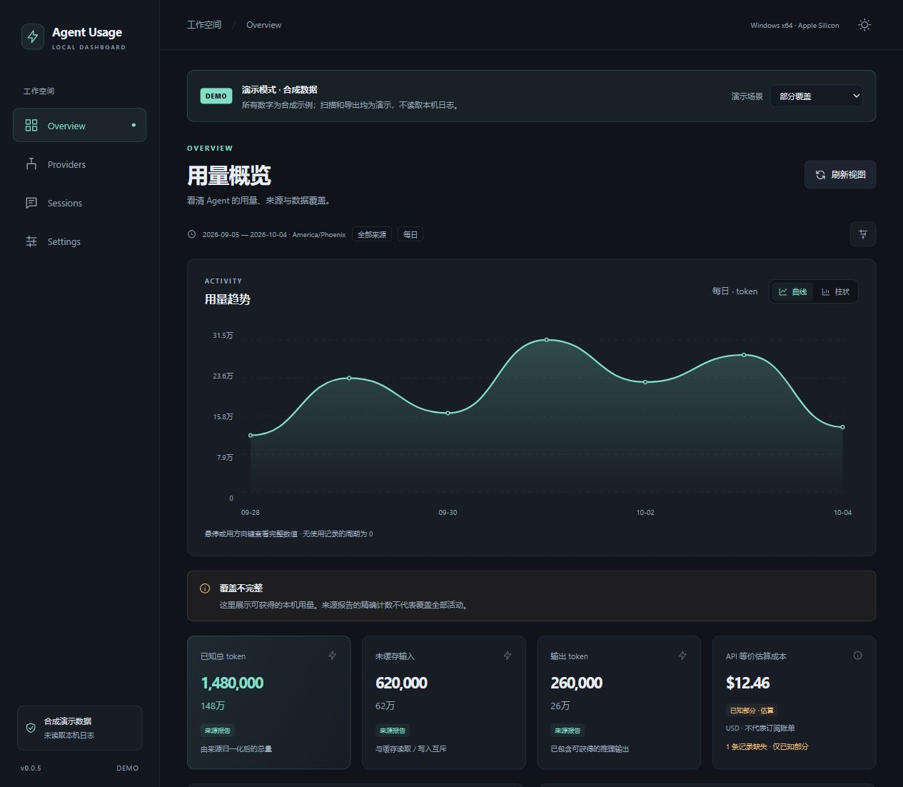
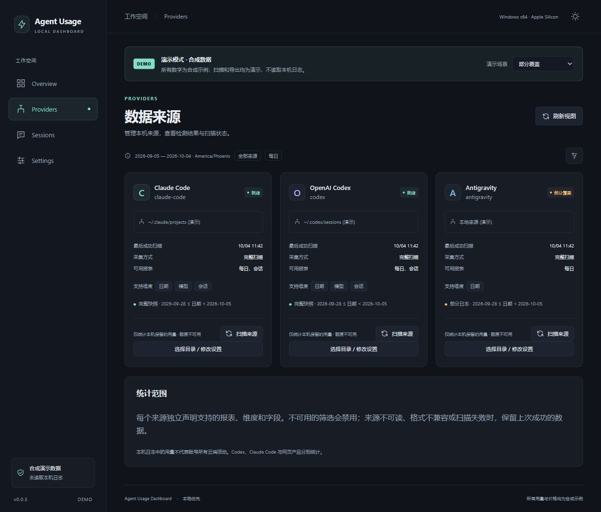
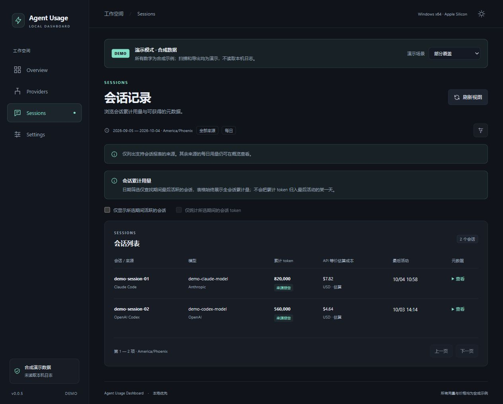

# Agent Usage Dashboard

在本机查看 **Claude Code、OpenAI Codex 和 Antigravity** 的 token 用量、API 等价估算成本与会话记录。

Track local AI agent usage on Windows and macOS.

[](https://github.com/upuphero/agent-usage-dashboard/actions/workflows/package.yml) [](docs/ci-validation/auto-full-scan-v1.md) [](LICENSE)

**Windows x64 · macOS Apple Silicon ARM64 · 本地存储 · 默认离线采集**

[下载安装](#下载安装) · [快速开始](#快速开始) · [数据来源与统计口径](#数据来源与统计口径) · [开发指南](#开发指南) · [路线图](#路线图)



*截图来自应用的浏览器演示模式，使用合成用量、示例模型和示例价格，不包含个人日志。*

## 主要功能

| 功能 | 可以做什么 |
| --- | --- |
| 用量趋势 | 按日、周、月查看用量，切换曲线图与柱状图，悬停查看完整数值 |
| 来源与模型分布 | 比较不同 Agent 和模型的用量，按 token 或估算成本降序排列 |
| 会话记录 | 查看来源、模型、累计 token、最后活动时间与可获得的元数据 |
| 数据来源管理 | 启用或关闭来源、选择日志目录、手动扫描、查看状态与覆盖范围 |
| 数据质量说明 | 区分来源报告、推导、估算与不可用字段，保留缺失价格和部分覆盖提示 |
| 导出 | 导出 JSON 完整历史归档或当前筛选范围的 CSV 报表 |
| 语言与显示设置 | 默认中文，可切换英文并保存偏好；深色、浅色、跟随系统主题 |
| 统计设置 | 来源开关与统计时区持久化 |
| 自动完整扫描 | 默认关闭；1/5/15 分钟检查、来源变化监听、休眠恢复检查与后台视图更新；两平台 CI 已通过，真实硬件恢复仍待验收 |

**0.0.6 更新：** 默认中文界面，右上角语言图标可切换英文并保存偏好。页面、筛选、状态和图表文字统一切换，保留当前筛选与图表状态。Windows/macOS 构建、原生测试和安装验证已通过。[更新与构建记录](docs/ci-validation/0.0.6-language-switch.md)

**0.0.7 更新：** 自动完整扫描第一版（API 1.2 / profile v4）已通过 Windows x64 / macOS ARM64 CI 原生测试、安装检查和出包。本机已下载并核对三份安装包 SHA-256；真实硬件休眠/GUI 等场景仍待验收。既有 0.0.6 安装包不包含本次功能。[构建与下载](https://github.com/upuphero/agent-usage-dashboard/actions/runs/37672597908) · [设计与验证记录](docs/ci-validation/auto-full-scan-v1.md)

0.0.5 已修复本地统计日期：新配置采用系统时区，旧 UTC 默认配置升级时自动迁移并重新扫描。[已验证的 0.0.5 构建](docs/ci-validation/0.0.5-local-time.md)

## 下载安装

[开发构建 / Daily build](https://github.com/upuphero/agent-usage-dashboard/actions/workflows/package.yml) — `main` 分支的代码或构建配置更新后自动构建，适合试用最新功能。选择最新一次 **成功完成** 的运行，在底部 **Artifacts** 下载 `desktop-installers-<commit-sha>`；解压后包含两平台安装包、`SHA256SUMS` 和构建验证信息。

[版本化发布 / Versioned releases](https://github.com/upuphero/agent-usage-dashboard/releases) — 带版本号的发布入口，供需要固定版本的用户使用。**目前仅有 `v0.0.1` 源码预览，尚未发布版本化安装包**；当前测试安装包请从上面的开发构建下载。

> **下载开发构建：** 需要登录 GitHub，Artifacts 仅保留 **1 天**。过期后需等待新的成功构建或从源码构建；当前流水线不会自动创建 Release。[下载说明](https://docs.github.com/en/actions/how-tos/manage-workflow-runs/download-workflow-artifacts)

> **从 0.0.6 升级：** 先退出旧程序。0.0.7 首次启动会自动升级本地配置格式，保留数据集身份、历史和已保存时区；自动采集默认关闭，可在设置中开启。升级配置后不建议降级到旧版本。[升级与验证记录](docs/ci-validation/auto-full-scan-v1.md)

各平台提供的安装包：

- **Windows x64 安装版** — `Agent Usage Dashboard_<version>_x64-setup.exe`，运行 NSIS 安装程序。
- **Windows x64 便携版** — `Agent Usage Dashboard_<version>_x64-portable.zip`，完整解压后运行 `usage-desktop.exe`；保留同目录的 `ccusage.exe` 和许可文件。
- **macOS Apple Silicon ARM64** — `Agent Usage Dashboard_<version>_aarch64.dmg`，打开 DMG，将应用复制到 Applications。

安装包已内置采集器，无需另装 Node.js、Rust 或 ccusage。Windows 需要 **WebView2 Runtime**；安装版包含下载引导，便携版依赖系统已有的 WebView2。Intel Mac、Linux 桌面及 Windows ARM64 暂不提供安装包。

当前仍为早期测试版本：Windows 未签名，macOS 使用 ad-hoc 签名，尚未完成 Developer ID 签名与公证。真实 GUI、硬件休眠、干净机、最低系统版本和用户数据升级场景仍待完整验收。[0.0.7 构建证据](docs/ci-validation/auto-full-scan-v1.md)

## 快速开始

1. 启动应用，进入 **Providers / 数据来源**。
2. 对需要统计的工具点击 **启用并扫描**。初次启动时，所有来源默认关闭。
3. 默认目录未找到时，进入 **Settings / 设置**，为相应来源选择本机日志目录，保存后重新扫描。
4. 回到 **Overview / 用量概览**，查看最近 30 天用量，也可切换今日、本周、本月以及来源、模型和图表粒度。
5. 需要保存报表时，在设置页面导出 JSON 或 CSV。

右上角主题按钮旁的语言图标可在中文和英文之间切换。首次使用默认中文，语言偏好保存在当前浏览器或桌面 WebView 中；切换语言会保留当前页面、筛选和图表状态。

日常采集可以手动触发，或在 **设置 → 自动采集** 中开启自动完整扫描。默认关闭，间隔可选 1、5、15 分钟（默认 5），保存后重启保留。启用/启动时先完整扫描一次，之后定时检查已启用来源，有变化时再次完整扫描；扫描结束自动更新来源、图表与会话，无需点击“刷新视图”。手动 **扫描来源** 仍可用。**刷新视图**只重新读取已有统计。

最小化时继续检查，退出应用后停止；休眠恢复合并为一次检查，不补跑错过的每个周期。关闭自动采集会清除待执行请求并取消尚未提交的自动任务，已提交结果和手动任务保留。自动任务也可单独取消，取消后等下一轮检查；失败保留历史并退避重试。来源关闭停止其自动检查并保留历史；来源目录/时区变更仅在没有活动扫描时保存，随后重建相应自动范围。间隔改变影响后续调度，语言切换不改变配置或触发扫描。

Changes trigger the existing **full scan**, not incremental accumulation. Automatic collection is off by default, runs only while the app is open, and retains successful history on failure or cancellation. Enable it in Settings and choose a 1, 5 or 15 minute interval.

安装版与便携版共享系统用户应用数据目录中的配置和历史。升级前先退出旧程序；使用便携包时请完整解压，保留同目录的 `ccusage.exe` 和许可文件。

<details>
<summary>界面预览：来源管理</summary>

管理来源开关、目录和扫描状态，并查看每个来源的报表能力与覆盖范围。



</details>

<details>
<summary>界面预览：会话记录</summary>

查看会话累计用量、模型与最后活动时间；截图中的会话均为合成示例。



</details>

## 数据来源与统计口径

| 来源 | 当前读取范围 | 说明 |
| --- | --- | --- |
| Claude Code | 本机 Claude Code 用量日志，通常位于 `~/.claude/projects` | 支持每日和会话报表，按实际日志提供模型与 token 字段 |
| OpenAI Codex | 本机 `.codex/sessions` 与 `archived_sessions` | 仅统计保留在本机的会话；未记录的价格档位按标准档位估算 |
| Antigravity | 已知格式的本机 conversation `.db` 数据库 | `.pb` 格式当前未支持；缺失的模型拆分保持不可用并提示覆盖限制 |

来源解析与价格计算使用锁定版本的 [ccusage](https://github.com/ryoppippi/ccusage)，由 Rust Adapter 归一化后交给 Core 聚合。新增上游支持仍需在本项目中验证后接入。

### 怎样理解这些数字

- **范围是本机保留的日志。** 未保存或已清理的日志、其他设备的活动和未接入的网页产品不会自动计入。
- **成本是 API 等价估算。** 它用于比较用量；订阅账单、剩余额度及官方扣费不在当前统计范围内。缺少价格时会显示不可用或已知部分。
- **缺失与零分开处理。** 完整覆盖范围内没有使用记录的日期可补零；未扫描、缺字段或覆盖不完整的数据保留明确提示。
- **会话展示累计用量。** 日期筛选用于寻找期间最后活跃的会话，表格仍展示全会话累计值；查看期间消费请使用每日趋势。
- **日期按统计时区分组。** 新配置采用系统本地时区，之后使用已保存的设置。手动更改统计时区后需要重新扫描原始日志。
- **字段以来源提供为准。** 推理输出属于输出总量的子集；来源或模型分布明细与总计也不应再次相加。

### 本地存储与隐私

采集命令以离线模式执行，仅提取用于统计的用量元数据，不采集认证文件，不保存或上传聊天正文。项目默认无遥测。

配置与统计保存在系统用户应用数据目录的 `profile.json` 和 `usage.db` 中，使用 SQLite 持久化。来源必须由用户启用；目录选择只针对指定来源，关闭来源会保留已有历史。

JSON 导出包含所选来源和时区的完整每日 / 会话历史及数据集身份；CSV 使用当前日期、来源和模型筛选。**归档导入、备份恢复界面和数据清除目前尚未开放。**

## 开发指南

### 工具链

| 工具 | 项目固定版本 |
| --- | --- |
| Node.js | `24.19.0`，见 [.node-version](.node-version) |
| pnpm | `9.15.0`，见 [package.json](package.json) |
| Rust | `1.91.1`，见 [rust-toolchain.toml](rust-toolchain.toml) |

桌面开发还需要对应平台的原生工具：Windows 的 MSVC C++ Build Tools 与 Windows SDK，或 macOS ARM64 的 Xcode Command Line Tools。具体准备方法见 [Tauri 2 官方前置要求](https://v2.tauri.app/start/prerequisites/)。浏览器演示只需要 Node.js 和 pnpm。

### 浏览器演示

```bash
git clone https://github.com/upuphero/agent-usage-dashboard.git
cd agent-usage-dashboard
pnpm install --frozen-lockfile
pnpm dev
```

打开 <http://127.0.0.1:1420/?client=mock>。浏览器模式使用合成数据，不访问本机日志，也不会真正扫描或导出文件；可在页面中切换部分覆盖、空数据、扫描失败等场景。

如果 `1420` 端口被占用或被系统保留，可仅为浏览器演示指定其他端口：

```bash
pnpm --filter @usage/dashboard exec vite --host 127.0.0.1 --port 5173 --strictPort
```

然后打开 <http://127.0.0.1:5173/?client=mock>。桌面开发使用 Tauri 配置中的 `1420` 端口，修改时需同时保持 `devUrl` 一致。

### 桌面开发与打包

以下命令在仓库根目录执行，并要求当前主机与目标架构匹配。

**Windows x64：**

```powershell
node scripts/prepare-ccusage.mjs --target x86_64-pc-windows-msvc
pnpm desktop:dev
```

```powershell
pnpm desktop:build --target=x86_64-pc-windows-msvc
```

**macOS Apple Silicon：**

```bash
node scripts/prepare-ccusage.mjs --target aarch64-apple-darwin
pnpm desktop:dev
```

```bash
pnpm desktop:build --target=aarch64-apple-darwin
```

完整构建会准备并验证锁定的采集器，随后生成本机平台的安装包。构建脚本拒绝跨目标、Intel Mac 和 universal 构建。原生测试、安装检查和 Actions 操作见 [CI 与打包指南](docs/GITHUB_ACTIONS.md)。

### 项目结构

```text
apps/dashboard/         React 界面、浏览器演示与客户端接口
apps/desktop/           Tauri 宿主、原生命令与打包配置
crates/usage-core/      统计、快照语义与业务用例
crates/usage-adapters/  来源读取、采集进程与 SQLite 存储
crates/usage-contracts/ 共享接口及 TypeScript 类型生成来源
scripts/                契约、依赖边界、版本和安装包校验
tests/fixtures/         合成来源日志与测试输入
docs/                   架构、验证记录及界面截图
```

前端通过统一 `UsageClient` 使用 Tauri IPC 或 Mock 客户端。统计和快照规则集中在 Core，具体来源和存储由 Adapter 接入；共享 DTO 从 Rust 契约生成。[架构说明](docs/coordination/architecture.md) · [接口基线](docs/coordination/CONTRACT_BASELINE.md)

### 检查与测试

```bash
pnpm contracts:check
pnpm boundaries:check
pnpm version:check
pnpm scripts:test
node --test crates/usage-adapters/tests/*.test.mjs
pnpm lint
pnpm typecheck
pnpm test
pnpm build
cargo test -p usage-core -p usage-contracts -p usage-adapters --locked
```

桌面端和采集器的原生集成测试还需要对应平台的编译工具与锁定采集器。[GitHub Actions](https://github.com/upuphero/agent-usage-dashboard/actions/workflows/package.yml) 会在 Windows x64 和 macOS ARM64 上构建、实际安装 / 解压，并再次运行合成数据集成测试；两个目标通过后才提供集中产物和 SHA-256 校验值。

## 路线图

更新：2026-10-07。三来源、本地时区/中文英文、来源设置与导出、自动完整扫描 v1、两平台原生测试/安装检查/出包已完成。CI 合成测试不等于真实 GUI、睡眠或用户数据升级验收。

- [x] 自动完整扫描 v1、后台事件刷新及两平台原生/安装 CI
- [ ] [T1–T3 真机验收](docs/coordination/TODO_GUIDE.md#t1)：真实 GUI/IPC、最小化/休眠恢复、干净机、升级与最低 OS
- [ ] [T4–T6 分发准备](docs/coordination/TODO_GUIDE.md#t4)：长期开发包/固定 Release、正式签名/公证、完整第三方 notices
- [ ] [T7 真正增量](docs/coordination/TODO_GUIDE.md#t7)：游标、去重、修正/轮转和完整扫描一致性
- [ ] [T8–T9 数据管理](docs/coordination/TODO_GUIDE.md#t8)：备份/恢复/清除/应用数据目录迁移、归档导入、多设备和独立数据集
- [ ] [T10–T11 统计扩展](docs/coordination/TODO_GUIDE.md#t10)：系统时区跟随、自定义日期和可信项目维度
- [ ] [T12 桌面体验](docs/coordination/TODO_GUIDE.md#t12)：托盘、开机启动、通知、经验证的自动更新
- [ ] [T13–T15 来源扩展](docs/coordination/TODO_GUIDE.md#t13)：Antigravity conversation .pb、可信订阅额度、ChatGPT Web/DeepSeek Harness/Cowork 与可选同步
- [ ] [T16 诊断展示](docs/coordination/TODO_GUIDE.md#t16)：可信采集版本和可获得的细进度，保留已有状态订阅

[完整功能/待办状态](docs/coordination/REMAINING_WORK.md) · [每项 TODO 的含义、例子与完成标准](docs/coordination/TODO_GUIDE.md)

## 参与贡献

欢迎提交 [Issue](https://github.com/upuphero/agent-usage-dashboard/issues) 或 Pull Request。报告问题时请提供系统 / 架构、应用版本、来源工具和复现步骤；截图与诊断信息请先脱敏，避免提交认证文件、完整聊天日志或个人数据库。

新增来源应明确报表、字段和覆盖范围，并提供合成 fixture；缺失字段使用不可用状态。修改共享接口时，请从 `crates/usage-contracts` 重新生成类型，并运行契约与依赖边界检查。

## 许可证

本项目源码采用 [MIT License](LICENSE)。采集器及第三方依赖的许可说明见 [THIRD_PARTY_NOTICES.md](THIRD_PARTY_NOTICES.md)，完整依赖许可库存仍在整理。
